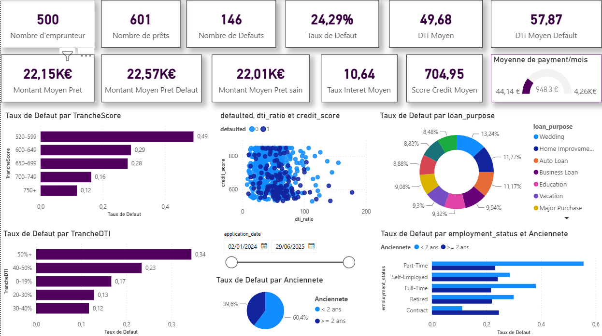
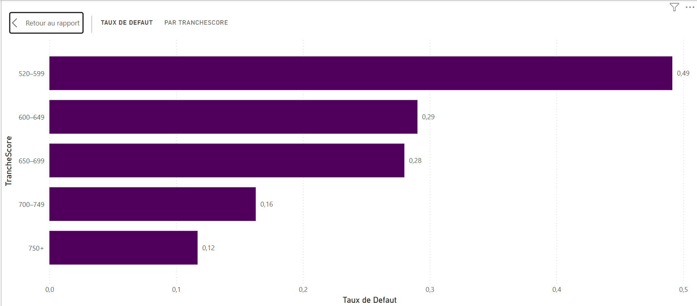
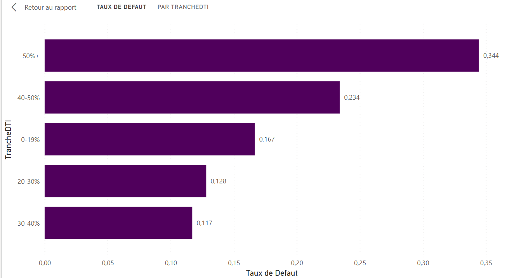
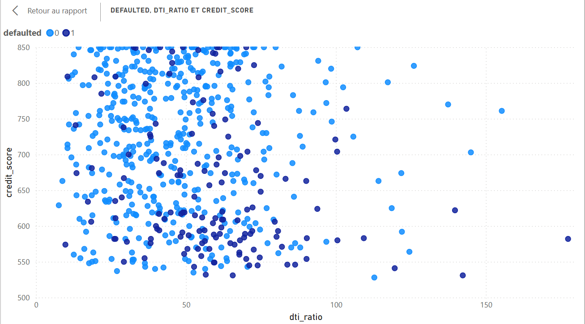
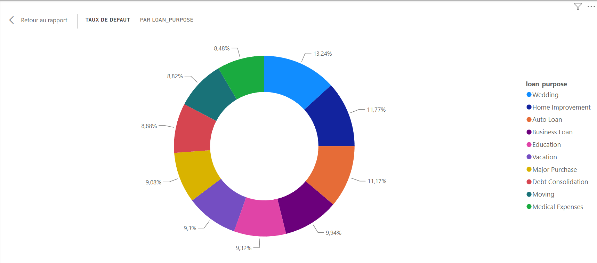
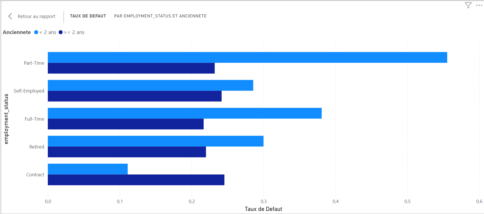

# 📊 Analyse du Risque de Défaut sur les Prêts Personnels
### Horizon Financial Group — Projet Power BI

> Analyse exploratoire du portefeuille de prêts personnels d'Horizon Financial Group visant à identifier les facteurs de risque de défaut et à proposer des seuils d'approbation fondés sur les données.

---

## 🗂️ Contexte

Horizon Financial Group a accordé **601 prêts personnels** entre 2024 et 2025. Le taux de défaut observé atteint **24,29 %**, soit près du double de l'objectif fixé à **12 %**. Le VP Risques a mandaté cette analyse pour comprendre les causes et réviser le modèle de scoring de crédit.

---

## 🎯 Questions d'analyse

| # | Question |
|---|----------|
| 1 | Quel est le taux de défaut global et comment se répartit-il par tranche de score de crédit ? |
| 2 | Existe-t-il une relation entre le ratio DTI et le risque de défaut ? |
| 3 | L'objet du prêt et le montant emprunté influencent-ils le risque de défaut ? |
| 4 | Quel est l'impact du statut d'emploi et de l'ancienneté professionnelle ? |

---

## 📁 Données utilisées

- **`borrower_profiles.csv`** — 500 emprunteurs (âge, emploi, ancienneté, revenus, score de crédit, etc.)
- **`loan_applications.csv`** — 601 prêts (montant, durée, taux d'intérêt, DTI, statut défaut)

Reliées par `borrower_id` dans un modèle relationnel Power BI (1 → N).

---

## 📈 Tableau de bord Power BI

Le tableau de bord regroupe 11 KPIs globaux et 6 visualisations interactives, filtrables par période et par ancienneté.

---

## 🔍 Visualisations & Résultats clés

### Question 1 — Taux de défaut par tranche de score de crédit

La tranche **520–599** affiche un taux de défaut de **49 %** — quatre fois supérieur à la tranche **750+** (12 %, soit exactement la cible de l'entreprise). La relation est quasi monotone : plus le score est élevé, plus le risque diminue.

---

### Question 2 — Relation entre le ratio DTI et le risque de défaut

Un **effet de seuil net apparaît à 40 % de DTI** : en dessous, le taux de défaut reste entre 12 % et 17 % ; au-delà, il bondit à 23 % (tranche 40–50 %) puis à **34 % pour les DTI > 50 %**. Le nuage de points confirme que le risque est maximal lorsque DTI élevé et score de crédit faible se combinent.

---

### Question 3 — Objet du prêt et montant emprunté

Les prêts **Wedding** (mariage) concentrent la part de défauts la plus élevée (13,24 %), suivis de **Home Improvement** et **Auto Loan**. En revanche, le montant moyen des prêts en défaut (22,57 K€) et des prêts sains (22,01 K€) est quasi identique : **le montant n'est pas un facteur discriminant**.

---

### Question 4 — Statut d'emploi et ancienneté professionnelle

Le statut **Part-Time** présente le risque le plus élevé parmi les employés à ancienneté < 2 ans (~55 %). L'ancienneté est le facteur le plus discriminant : les emprunteurs avec **moins de 2 ans d'ancienneté** affichent un taux de défaut de ~34,5 % contre ~22,6 % pour ceux avec ≥ 2 ans (écart de **12 points**).

---

## ✅ Recommandations pour la souscription

| Critère | Seuil recommandé | Justification |
|---------|-----------------|---------------|
| Score de crédit | ≥ 650 | En dessous, le taux de défaut dépasse 28 % |
| Ratio DTI | ≤ 40 % | Au-delà, le risque double brutalement |
| Ancienneté | ≥ 2 ans | Risque 50 % plus élevé en dessous du seuil |

> En combinant ces trois critères, l'équipe de souscription dispose d'un filtre simple et data-driven pour ramener le taux de défaut vers l'objectif de **12 %**.

---

## 📄 Rapport complet

Le rapport détaillé (analyse, visualisations et interprétations) est disponible ici :
**[Voir le rapport complet en pdf](https://drive.google.com/file/d/1RYuldKmYmUQiO5ctBMxbuNlIDHrTeOm1/view?usp=drive_link)**

---

## 🛠️ Outils utilisés

- **Power BI Desktop** — modélisation, visualisations, tableau de bord
- **Power Query** — nettoyage et préparation des données
- **DAX** — calcul des KPIs et des colonnes calculées (TrancheScore, TrancheDTI, Ancienneté)

---
